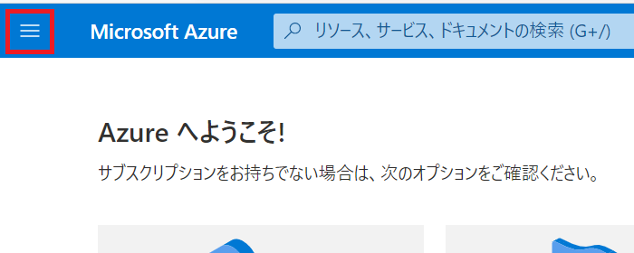
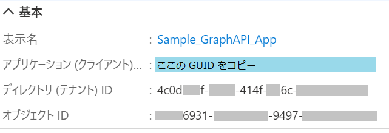

# 演習 4 : タブとボットのシングルサインオン
GitHub に用意されているサンプル プロジェクトを使用して Microsoft Teams のタブ アプリケーションとボットにシングルサインオン (Single Singon : SSO) を設定します。

## サンプル プロジェクトの入手

Visual Studio、もしくは Visual Studio Code 用 Teams Toolkit 拡張が生成する SSO を実現する機能を実装したプロジェクトを使用するか、GitHib リポジトリ[**Microsoft Teams Samples**](https://github.com/OfficeDev/Microsoft-Teams-Samples) から[タブ アプリ](https://github.com/OfficeDev/Microsoft-Teams-Samples/tree/main/samples/tab-sso/nodejs)、[ボット](https://github.com/OfficeDev/Microsoft-Teams-Samples/tree/main/samples/bot-conversation-sso-quickstart/js)のそれぞれのサンプル プロジェクトを Clone するか zip ファイルとして入手します。

なお、Clone も zip ファイルとしての入手も、リポジドリ全体が取得されるので、ディスク容量が気になる場合は、zip ファイルで取得して、必要なサンプル プロジェクトだけ解凍して使用したほうが良いでしょう。

サンプルプロジェクトの具体的な入手方法は以下の通りです。

* **Clone (※ [**git**](https://git-scm.com/downloads) がインストールされている必要があります)**
    
    コマンドプロンプトで任意のディレクトリに移動して以下のコマンドを実行します。

    `git clone https://github.com/OfficeDev/Microsoft-Teams-Samples.git`

* **zip ファイルとして入手**

    サンプルの[**リポジトリ**](https://github.com/OfficeDev/Microsoft-Teams-Samples.git)にアクセスして緑色の \[**Clone  or download**\] ボタンをクリック

    表示されたダイアログボックスの \[**Download ZIP**\] ボタンをクリックします。

    

    ダウンロードされた zip ファイルから任意のプロジェクトのフォルダを解凍します。


## 演習 4-1 SSO (Single-SingOn ) をサポートする タブアプリの実行

SSO をサポートするシンプルなタブ アプリのサンプルが動作するように構成します。

なお、この演習では Node.js のサンプルを使用します。

具体的な手順は以下のとおりです。

1. Microsoft-Teams-Samples/tree/main/samples/tab-sso/nodejs のプロジェクトを任意のフォルダに展開し、Visual Studio Code でオーブンします。

2. メニュー[Terminal]-[New Terminal] をクリックしてターミナル ウィンドウを開き、以下のコマンドを入力して依存関係のあるモジュールをインストールします。

    ```
    npm install
    ```
3. 赤文字でなにかしら表示された場合は以下のコマンドを実行します。

    ```
    npm audit fix --force
    ```

4. 以下のコマンドを実行し、正常にサービスが開始できることを確認します。

    ```
    npm audit fix --force
    ```

5. 以下のコマンドを実行し、正常にサービスが開始できることを確認します。

    ```
    npm start
    ```

    正常にサービスが開始できるとターミナル ウィンドウに以下のメッセージが表示されます

    App started listening on port 3333

    また、Web ブラウザーから以下の URL にアクセスして「Azure AD SSO Tab Demo」と書かれたページが表示されるか確認してください。

    ```
    http://localhost:3333/ssoDemo
    ```
    
6. OS のメニューからコマンドプロンプトを起動し、作業ディレクトリを　ngrok のインストールされているディレクトリに切り替え、以下のコマンドを実行します、

    ```
    ngrok http 3333 -host-header=localhost:3333
    ```

    ngrok が返す https のドメイン名をコピーしてメモ帳などに貼り付けて保持します。

    ngrok はこの演習が完了するまで終了しないでください。

7. Web ブラウザーから以下の URL にアクセスしてページが表示されるか確認します。

    ```
    https://ngrok が返すドメイン名/ssoDemo
    ```

    アプリケーションのサービスとネットワーク接続が正常に動作していることが確認できたら Azure Active Directory にアプリケーションの登録を行います。

8. Azure のポータルにログインします

9. 左上にあるハンバーガーメニューをクリックしてメニュー ブレードを表示し **[Azure Active Directory]** を選択します

    

10. Azure AD のブレードより **\[アプリの登録\]** をクリックします

11. アプリの登録画面が表示されるので画面上部の **\[+ 新規登録\]** メニューをクリックします

    

12. アプリケーションの登録画面が表示されるので **\[名前\]** にアプリケーション名を入力します

    この演習では "**SSO_teams_tab**" という名前を使用します。なお、この名前は後で変更することができます

13. \[サポートされているアカウントの種類] で、 **\[任意の組織ディレクトリ内のアカウント (任意の Azure AD ディレクトリ - マルチテナント) と個人の Microsoft アカウント (Skype、Xbox など)]**を選択します

14. \[リダイレクト URI (省略可能)] のドロップダウンリストから \[Web] を選択し、右側のテキストボックスに以下の URL を記述します

    ```
    https://ngrok が生成したドメイン名/auth-end
    ```

15. \[登録] ボタンをクリックします。

16. 画面左のメニューの \[概要\] をクリックし、表示された画面で **\[アプリケーション (クライアント)\]** の内容をコピーし、テキストファイルなどにメモします

    

17. 画面左のメニューで \[API の公開] を選択します

18. \[設定]リンクをクリックすると、api://{AppID} の形式でアプリケーションIDのURIが生成されるので、api://の後ろに ngrok が生成したドメイン名を挿入して以下の形式の URI を設定します

    ```
    api://ngrok が生成したドメイン名/AppIDのGUID
    ```
19. \[+ Scope の追加]をクリックして\[スコープ名*] に **access_as_user** と入力します

20. \[同意できるのはだれですか?] トグルボタンで \[**管理者とユーザー**]を選択します。

22. 他の項目を以下のように設定します。

    |項目|値|
    |---|---|
    | 管理者の同意の表示名 | Teams は、ユーザーのプロファイルにアクセスできます。 |
    | 管理者の同意の説明 | Teams は、アプリの Web API を現在のユーザーとして呼び出します。|
    | ユーザーの同意タイトル | Teams はユーザー プロファイルにアクセスし、ユーザーの代わりに要求を行うことができます。|
    | ユーザーの同意の説明 | Teams は、ユーザーと同じ権限でこのアプリの API を呼び出します。|

23. \[状態] トグルボタンが \[**有効**] になっていることを確認し、\[スコープの追加] ボタンをクリックします。

24. \[承認済 みクライアント アプリケーション] セクションで、\[クライアント アプリケーションの追加] をクリックし、以下の GUID をそれぞれ入力し \[アプリケーションの追加] ボタンをクリックして登録します。

    |GUID|アプリケーション|
    |---|---|
    | 1fec8e78-bce4-4aaf-ab1b-5451cc387264 | Teams モバイル またはデスクトップ アプリケーション用 |
    | 5e3ce6c0-2b1f-4285-8d4b-75ee78787346 | Teams Web アプリケーション用|

25. 画面左のメニューで \[API のアクセス許可] をクリックします

26. \[+ アクセス許可の追加] をクリックし、画面右に表示されたブレード内の \[Microsoft Graph]-\[委任されたアクセス許可]ボックスをクリックし、以下の権限にチェックをつけ \[アクセス許可の追加] ボタンをクリックします
    - user.Read (既定で有効)
    - mail
    - offline_access
    - openId
    - profile

    \[(ドメイン名) に管理者の同意を与えます] をクリックし、リストされたアクセス許可の \[状態] に緑色のアイコンが表示されるのを確認します

27. 画面左のメニューで \[認証] をクリックします

28. 項目\[暗黙的な許可およびハイブリッド フロー]で以下のチェックボックスにチェックをつけ、画面上部の \[保存] をクリックします

    - アクセス トークン (暗黙的なフローに使用)
    - ID トークン (暗黙的およびハイブリッド フローに使用)

29. 画面左のメニューで \[証明書とシークレット] をクリックします

30. \[+新しいクライアント シークレット]をクリックすると、\[クライアント シークレットの追加] ダイアログボックスが表示されるので、\[説明] に用途について分かり易い説明を記述し、\[有効期限] オプションボタンで \[なし] を選択して\[追加] ボタンをクリックします

31. クライアントシークレットが生成されるので \[値] の内容をメモ帳などにコピーして保持します

    ここまでで Azure Active Directory 側の設定は完了です

32. Visual Studio Code で、開かれているサンプル アプリケーションの **/config/default.json** ファイルをオープンし、以下のように JSON を書き換えます
    ```
    {
        "tab": {
            "appId": "Azure Active Directory で設定した App ID",
            "appPassword": "クライアント シークレット"
        },
        "port": "3333"
    }
    ```

33. Visual Studio Code のターミナルウィンドウで、キーボードの \[Ctrl]-\[C] をクリックし、サービスを終了し、再度、npm start を実行してサービスを再起動します

    アプリケーション側の設定はこれで完了です

34. Microsoft Teams で App Studio を起動し、[演習 1 の内容](Ex01.md#app-studio-%E3%82%92%E4%BD%BF%E7%94%A8%E3%81%97%E3%81%9F-teams-%E3%82%A2%E3%83%97%E3%83%AA%E3%82%B1%E3%83%BC%E3%82%B7%E3%83%A7%E3%83%B3%E3%81%AE%E7%99%BB%E9%8C%B2)の手順に従い、新規のアプリを作成するか、既存のアプリの設定を開きます

35. App Studio の画面左のメニューツリーで \[2 Capabilities] - [Tabs] をクリックします

    

36. 右側に Tabs の画面が表示されるので、ラベル Add a personal tab の下の [Add] ボタンをクリックします。

    (※)このサンプルアプリケーションは /configure を指定することでチームタブも設定できますが、結果がパーソナルタブとまった一緒なのでパーソナルタブで検証します。

37. Personal tab の設定ダイアログボックスが表示されるので、各項目を以下のように設定し、\[Save] ボタンをクリックします

     |項目|値|
    |---|---|
    | *Name | SSO Tab |
    | *Entity ID | ssotab |
    | *Content URL | https://ngrokのドメイン/ssoDemo |
    | Website URL | 入力なし |

    実際の画面は以下の通りです。

    

38. 画面左のメニューツリーで \[③ Finish] - \[Domain and permissions] をクリックします

39. \[AAD App ID] に Azure Active Directory にアプリケーションを登録した際のアプリケーション ID (Client ID) を指定し、\[Single-Sign-On]には Azure Active Directory メニュー \[API の公開] 画面の \[アプリケーション ID の URI] の値を指定します。

    具体的には以下のフォーマットの URL です。

    api://ngrokのドメイン名/Azure AD に登録されているアプリケーション ID

40. App Studio の左側のツリーメニュー [③ Finish] - [Test ans distribute] をクリックします。

41. Test and Distribute の画面が表示されるので同画面の \[Install] ボタンをクリックします。

42. 作成したアプリのダイアログボックスが表示されるので \[追加] ボタンをクリックします。

Teams 内にタブとして作成した Web ページが表示され、以下のように Teams タブから取得した認証トークンとサーバーサイドで取得したトークン、現在 Teams を使用しているユーザーの詳細なプロファイルが表示されていることを確認してください。


### サンプルアプリケーション内の動作

このサンプルアプリでは内部で [Microsoft Teams JavaScript クライアント SDK](https://docs.microsoft.com/ja-jp/microsoftteams/platform/tabs/how-to/using-teams-client-sdk) の getAuthTokenメソッドを使用して、Teams タブ用の認証トークンを取得し、

```
//getAuthTokenメソッドによる認証トークンの取得 - ssoDemo.js より抜粋
microsoftTeams.authentication.getAuthToken({
    successCallback: (result) => {
        display(result)
        resolve(result);
    },
    failureCallback: function (error) {
        reject("Error getting token: " + error);
    }
});
```

Teams タブ用の認証トークンを使用して、アクセストークンを取得し、

```
//アクセストークンの取得 - tabs.js より抜粋
app.post('/auth/token', function(req, res) {
        var tid = req.body.tid;
        var token = req.body.token;　//←認証トークン
        var scopes = ["https://graph.microsoft.com/User.Read"];

        var oboPromise = new Promise((resolve, reject) => {
            const url = "https://login.microsoftonline.com/" + tid + "/oauth2/v2.0/token";
            const params = {
                client_id: config.get("tab.appId"),
                client_secret: config.get("tab.appPassword"),
                grant_type: "urn:ietf:params:oauth:grant-type:jwt-bearer",
                assertion: token,
                requested_token_use: "on_behalf_of",
                scope: scopes.join(" ")
            };
        
            fetch(url, {
              method: "POST",
              body: querystring.stringify(params),
              headers: {
                Accept: "application/json",
                "Content-Type": "application/x-www-form-urlencoded"
              }
            }).then(result => {
              if (result.status !== 200) {
                result.json().then(json => {
                  // TODO: Check explicitly for invalid_grant or interaction_required
                  reject({"error":json.error});
                });
              } else {
                result.json().then(json => {
                  resolve(json.access_token);
                });
              }
            });
        });

        oboPromise.then(function(result) {
            res.json(result);
        }, function(err) {
            console.log(err); // Error: "It broke"
            res.json(err);
        });
    });
```

取得したアクセストークンを使用して Graph API にアクセスします。

よって、**① Azure Active Directory へのアプリの登録方法、認証トークンの入手方法**、**② アクセストークンの入手方法**を理解すれば、既存の Web ページを使用して Teams タブ アプリを開発する際に SSO をサポートすることができます。


サンプル プロジェクトが必要とするさまざまなモジュールをダウンロードしてインストールします。この作業は **npm** コマンドを使用して一括して行われます。
手順は以下のとおりです。

1. コマンドプロンプトを起動し、作業ディレクトリをダウンロードしたプロジェクトのフォルダ **microsoft-teams-sample-complete-node** に切り替えます。

2. 以下のコマンドを実行します。
    ```
    npm install
    ```
    プロジェクトのビルドや実行に必要となるモジュールがダウンロードされるので完了するまで待ちます。

3. 以下のコマンドを実行して Visual Studio Code 起動します。

    ```
    code .
    ```

4. Visual Studio Code のメニュー\[**Debug**\] - \[**Start Debugging**\] をクリックするか、キーボードの \[**F5**\] キーを押下してデバック実行を開始します。

    画面下部にターミナルウィンドウが表示され以下のメッセージが最後に表示されれはプロジェクトを動かす準備は完了です。
    ```
    Express server listening on port 3978

    Server running successfully
    ```
    起動の確認ができたら \[**Debug**\] - \[**Stop Debugging**\] をクリックするか、キーボードの \[**Shift**\] + \[**F5**\] キーを押下してデバック実行を終了します。

    もし、上記の出力がなく、エラーも発生している様子がない場合は、以下の URL にアクセスし、

    ```
    http://127.0.0.1:3978/tab-auth/silent
    ```
    以下のページが表示されれば問題ありません。

    

### ■ 既知の問題 ■

現在 (2019/10) の Node.js の安定版(v10.16.3)でプロジェクトを実行させようとすると Gulp の実行でエラーが発生し、プロジェクトを動作させることができません。

この問題については GitHub の [Issue に登録済](https://github.com/OfficeDev/microsoft-teams-sample-auth-node/issues/19)ですが、現在はまだ回避策をふくめレスがありません。

とりあえずの回避策としては、以下のサイトより以前のバージョンの Node.js を使用することで回避できる場合があります。

* [**node.js.org - Previous Releases**](https://nodejs.org/en/download/releases/)


## インターネットへのトンネリング
ローカル環境で動作するサンプル アプリケーションを Microsoft Teams から参照可能にするために、ngrok を使用してインターネットへのトンネリングを構成します。

手順は以下の通りです。

1. コマンドプロンプトを起動し、以下のコマンドを実行してシェルを cmd.exe に切り替えます。

    ```
    cmd
    ```

2. 作業ディレクトリを ngrok.exe のあるディレクトリに切り替え以下のコマンドを実行します。

    ```
    ngrok http 3978 --host-header=localhost
    ```
3. ローカル環境でサンプル アプリケーションが動作している状態で、Web ブラウザーから ngrok が返す https のドメイン名を使用して以下のようにアクセスします。

    ```
    https://ngrokが返したランダムな数字.ngrok.io/tab/silent
    ```

    ローカルアドレスで接続したのと同じページが表示されれば完了です。


## サンプル プロジェクトのアプリケーション登録

入手したサンプルプロジェクトを Microsoft Teams にタブとボット アプリケーションとして登録します。

### タブ アプリケーション ##

[演習 2](Ex02.md) の内容を参考にして パーソナル タブ アプリケーションとして登録します。

**Personal Tab** ダイアログボックスの \[**\*Name**\]、\[**\*Entity ID**\] に指定するものは任意の値でかまいません。

同ダイアログボックスの \[**\*Content URL**\] には以下の URL を指定します。

```
https://ngrok が生成したドメイン名/tab/silent
```


### ボット アプリケーション

[演習 3](Ex03.md) の内容を参考にしてボット アプリケーションとして登録します。

ボットを作成すると、Azure AD 上にアプリケーションの登録が自動で行われます。

Microsoft Teams へのボットの登録が完了したら、App Studio の左側のツリーメニュー \[**③ Finish**\] - \[**Domain and permissions**\] をクリックし、画面右の **Valid domains** を確認して ngrok が生成したドメイン名が登録されていることを確認してください。

この設定は Teams アプリケーションの SSO 処理に必要ですが、ボットの登録だけでは行われません。もし、SSO 処理が必要なボット アプリケーションだけを登録する場合、この設定は手動で行う必要があります。


なお、ここで行う作業はあくまでも Microsoft Teams へのアプリケーションの登録のみで、インストールは行わないでください。

## サンプル アプリケーションへの認証処理に必要な情報の追加

サンプル アプリケーションに SSO 処理に必要な情報を追加します。

手順は以下のとおりです。

1. Visual Studio Code でサンプルアプリケーションのプロジェクトを開きます

2. Visual Studio Code の左側にあるプロジェクトのツリービューで .vscode フォルダの下にある **launch_example.json** ファイルの名前を **launch.json** に変更します

3. **launch.json** 内の JSON のプロパテを以下のようにすべて変更します

    |プロパティ|値|
    | ---- | ---- |
    |BASE_URI|**ngrok が生成したドメイン名**|
    |MICROSOFT_APP_ID|**ボットを登録するときに生成された ボットID**|
    |MICROSOFT_APP_PASSWORD|**ボットを登録するときに生成したパスワード**|

4. サンプルアプリケーションのプロジェクト内、**./src/views/tab** ディレクトリ配下にあるファイル **silent.hbs**、**silent-start.hbs**、**silent-end.hbs** のコードを編集します。

    各ファイル中のコード内の **{{appId}}** を **ボットを登録するときに生成された ボットID** に書き換えます。

## Azure AD へのアプリケーションの登録
前の手順てサンプル プロジェクトが Azure AD (Active Directory) にアプリケーションとして登録されているので認証処理を有効にするための設定を行います。

**なお、この方法は Microsoft Azure のサブスクリプションを持っていなくても Office 365 のサブスクリプションがあれば行うことできます。**

手順は以下のとおりです。

### アプリケーションの Azure AD への登録
1. [Azure のポータル](https://portal.azure.com/)にログインします。

2. 左のメニューより \[**Azure Active Directory**\] を選択します。

3. Azure AD のブレードより \[**アプリの登録**\] をクリックします。

4. 画面右に表示されたアプリケーションのリストから、サンプル アプリケーションの名前をダブル クリックします。

    今回はボットを登録したのでアプリケーションの名前が一覧に表示されますが、タブ アプリケーションだけの場合は自動でアプリケーションの登録は行われません。その場合は画面上の \[**+新規登録**] ボタンをクリックして手動でアプリケーションの登録を行います。

5. 選択したアプリケーションの設定画面に遷移するので、画面左のメニューより\[**認証**\] をクリックします。

6. 各項目を以下のよう設定して \[登録\] ボタンをクリックします。

    **リダイレクト URI**    

    |種類|リダイレクト URI|
    | ---- | ---- |
    |Web|https://ngrok のドメイン名/auth/azureADv1/callback|
    |Web|https://ngrok のドメイン名/tab/silent-end|


    **暗黙の付与**

    以下のチェックボックスにチェック
    
    * **アクセス トークン**
    * **ID トークン**

    以下は実際の画面です。

    

7. 画面上の \[**保存**\] ボタンをクリックして保存します。

8. 左側のブレードの \[**証明書とシークレット**\] をクリックします。

9. \[**+新しいクライアント シークレット**\] ボタンをクリックすると、\[**クライアント シークレットの追加**\] ダイアログボックスが表示されるので、項目を以下のように設定します。

    |項目|値|
    | ---- | ---- |
    | 説明 | Forever |
    |有効期限|なし|

10. \[**追加**\] ボタンをクリックして保存します。

11. 左側のブレードの \[**API のアクセス許可**\] をクリックします。

12. 画面右側に \[API のアクセス許可\] ペインが表示されるので \[ **+ アクセス許可の追加**\] ボタンをクリックします。

13. 画面右に \[API アクセス許可の要求\] ブレードが表示されるので、同ブレード内の \[**所属している組織で使用している API**\] リンクをクリック

14. API を公開しているアプリの一覧から **Microsoft Graph** をクリックします。

15. 項目 \[アプリケーションに必要なアクセス許可の種類\] で \[**委任されたアクセス許可**\] ボタンをクリックします。 

16. 項目 \[アクセス許可を選択する\] にアクセス許可の一覧が表示されるので、**User.Read** のチェックボックスにチェックをつけ \[**アクセス許可の追加**\] ボタンをクリックします。

17. 同画面下部にある \[**管理者の同意を与えます**\] ボタンをクリックします。

以上でアプリケーションの Azure AD への登録は完了です。
　
　
## アプリケーションの SSO 処理の動作の確認

サンプルアプリケーションをインストールして SSO 処理の動作を確認します。

なお、この手順を実行する前に Visual Studio Code でデバッグ実行を開始し、ngrok が動作していることを確認してください。

サンプルアプリケーションの SSO 処理の動作を確認する手順は以下のとおりです。

1. App Studio で Manifest editor メニューを選択し、登録されているアプリケーションのリストからサンプルアプリケーションのタイルをクリックします。

2. 左側のツリーメニューより \[**③ Finish**\] - \[**Test and Distribute**\] をクリックします。

3. Test and Distribute の画面内の \[**Install**\] ボタンをクリックします。

4. 表示されたダイアログボックスで \[**追加**\] ボタンをクリックします。

5. インストールが完了すると、ボットとのチャット画面に遷移するので Hi と入力して送信します。

6. ボットの返信の中に「Select an identity provider」といメッセージ、\[LinkedIn\]、\[AzureAD (v1)\]、\[Google\] の 3 つのボタンが表示されるので \[**AzureAD (v1)**\]をクリックします。

    

7. 「Please sign in to AzureAD so I can access your profile.」というメッセージに続き Azure AD についての \[Sign in\]、\[Show profile\]、\[Sign out\]、\[Back\] ボタンが表示されるので \[**Sign in**\] ボタンをクリックします。

    

8. 「Click below to sign in to Azure AD」というメッセージに続き \[**Sign in**\]　ボタンが表示されるのでクリックします。

    

9. Sign in ダイアログボックスが表示されるのでアカウント情報を入力して認証処理を行います。

    

10. サインインの成功すると以下のようなプロファイル情報が表示されます。

    

    続いて、タブ アプリケーションの SSO の動作を確認します。

11. ボットとの会話チャネルにサンプル アプリケーションのタブが追加されているのでアクティブにします。

12. タブ内の \[**Login to Azure AD**\] ボタンをクリックします。

    

13. ボット側でログイン済みの場合はログイン用のポップアップは表示されず、ボットよりもより詳しいユーザーのプロファイル情報が表示されます。

    ボット側でログインがされていない場合は、Sign in ダイアログボックスが表示されるのでアカウント情報を入力して認証処理を行ってください。

   ボット、タブ問わず、ログインが成功した場合は、再度タブを表示した場合に \[**Login to Azure AD**\] ボタンは表示されず、ユーザーのプロファイル情報が取得されていることを確認してください。

**⇒【 5. [メッセージ拡張とメッセージアクション](Ex05.md) 】へ**

\<参考\>

* [**Authentication in Teams**](https://docs.microsoft.com/en-us/microsoftteams/platform/concepts/authentication/authentication)

## 目次
0. [**Microsoft Teams アプリケーション開発について**](Intro.md)

1. [**Microsoft Teams アプリケーションの新規作成**](Ex01.md)
    * [**App Studio を使用したマニフェストファイルの作成**](Tut02.md#app-studio-を使用した-teams-アプリケーションの登録)
2. [**タブ アプリケーション**](Ex02.md)
    * [**パーソナル タブ**](Ex02.md#%E3%82%BF%E3%82%B9%E3%82%AF-1--%E3%83%91%E3%83%BC%E3%82%BD%E3%83%8A%E3%83%AB-%E9%9D%99%E7%9A%84-%E3%82%BF%E3%83%96%E3%81%AE%E8%BF%BD%E5%8A%A0)
    * [**チーム タブ**](Ex02.md#%E3%83%81%E3%83%BC%E3%83%A0-%E6%A7%8B%E6%88%90%E5%8F%AF%E8%83%BD-%E3%82%BF%E3%83%96%E3%81%AE%E8%BF%BD%E5%8A%A0)

    * [**タブ : タスクモジュールの表示**](https://github.com/osamum/Easyway-for-MSTeamsAppDev/blob/master/Ex02.md#タスク-3-タブでのタスク-モジュールの表示)
    
3. [**ボット**](Ex03.md)
    * [**ボットの登録**](https://github.com/osamum/Easyway-for-MSTeamsAppDev/blob/master/Ex03.md#microsoft-teams-へのボットの登録)
4. [**メッセージ拡張**](Ex04.md)
5. [**タブとボットのシングルサインオン**](Ex05.md)
6. [**コネクタ**](Ex06.md)


